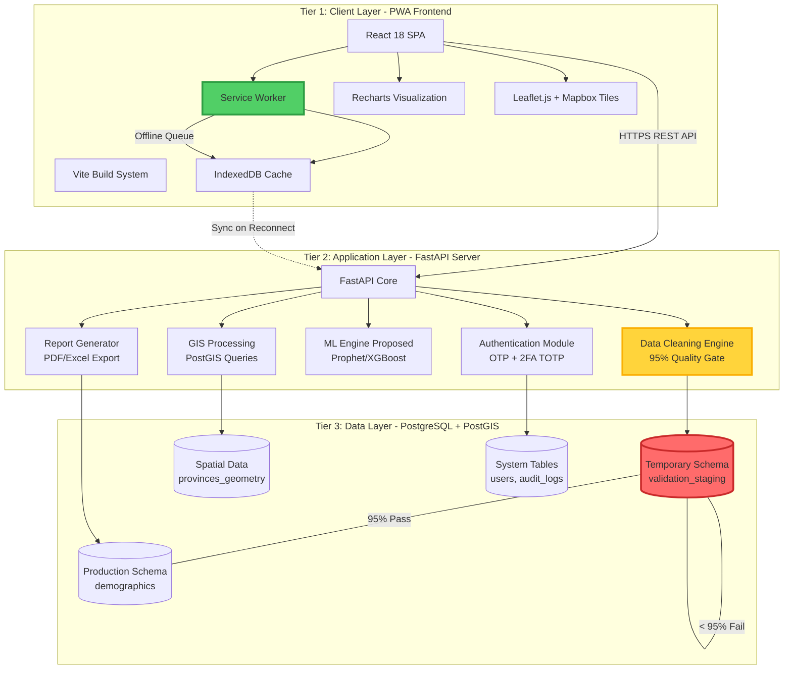
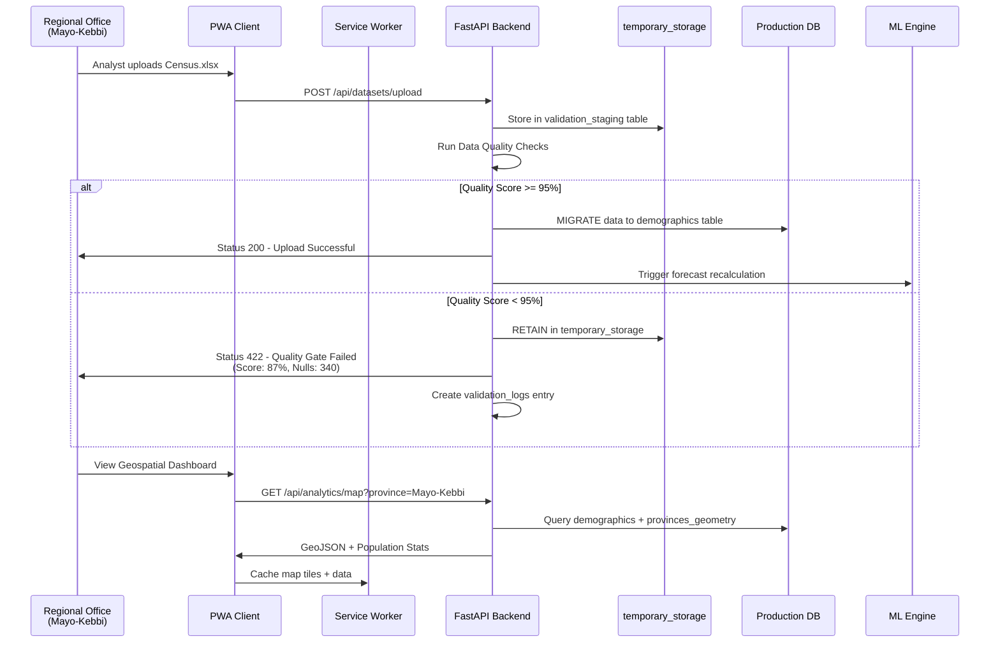
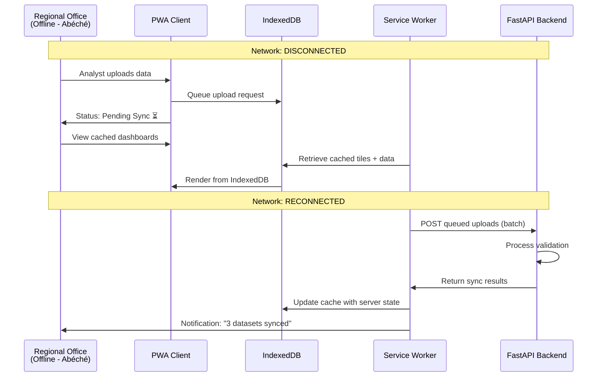
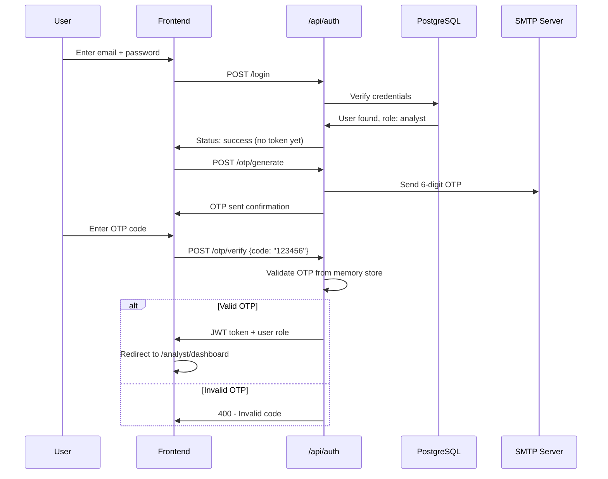

# DataVision Tchad: System Architecture & Data Flow Specification

**Platform**: Demographic Modernization & AI Forecasting for INSEED Chad  
**Document Version**: 1.0  
**Date**: February 2026  
**Target Infrastructure**: Low-bandwidth, intermittent connectivity (Chadian Provinces/Départements)

---

## Executive Summary

DataVision Tchad employs a **decoupled 3-tier architecture** designed specifically for the challenging infrastructure constraints of the République du Tchad. The platform transforms manual Excel-based demographic workflows into an advanced web application with offline-first capabilities, ensuring uninterrupted operation in regional offices across N'Djamena, Moundou, Abéché, and rural départements.

The architecture prioritizes:
- **Résilience**: Progressive Web App (PWA) with aggressive offline caching
- **Intégrité**: Mandatory 95% Data Quality Gate with blocking validation
- **Scalabilité**: RESTful API design supporting concurrent multi-province data uploads
- **Souveraineté des Données**: On-premise PostgreSQL deployment within INSEED infrastructure

---

## 1. Three-Tier Architecture Overview



---

## 2. Data Flow: Regional Office to Central Server

### 2.1 Normal Operation Flow (Online)



### 2.2 Offline Operation Flow (Disconnected)



---

## 3. Progressive Web App (PWA) Offline-First Design

### 3.1 Service Worker Caching Strategy

**File**: `Frontend/public/service-worker.js`

The PWA implements a **Cache-First with Network Fallback** strategy tailored for Chad's unreliable connectivity:

| Resource Type | Caching Strategy | TTL | Rationale |
|---------------|------------------|-----|-----------|
| **App Shell** (HTML/CSS/JS) | Cache-First | 7 days | Enable instant offline app launch |
| **API Responses** (`/api/analytics/*`) | Network-First | 24 hours | Fetch latest data when online, fallback to cache |
| **Mapbox/Leaflet Tiles** | Cache-First | 30 days | Minimize bandwidth consumption for geospatial views |
| **Static Assets** (icons, fonts) | Cache-Only | Indefinite | Pre-cached during install |
| **User Uploads** | Queue-Based | N/A | Queue in IndexedDB, sync when online |

### 3.2 Offline Storage Architecture

```
IndexedDB Stores:
├── analytics_cache       // Cached dashboard data
├── upload_queue          // Pending dataset uploads
├── map_tiles             // Leaflet raster tiles (zoom levels 5-10)
├── geojson_boundaries    // Chad provinces/départements geometry
└── user_session          // Authentication tokens + preferences
```

**Storage Quota Management**:
- Target: 50MB per province (sufficient for 12 months of demographic data)
- Cleanup Policy: LRU eviction when approaching 80% quota
- Critical Data: User authentication and pending uploads are never evicted

### 3.3 Vite Build Configuration for PWA

**File**: `Frontend/vite.config.ts`

```typescript
import { defineConfig } from 'vite'
import { VitePWA } from 'vite-plugin-pwa'

export default defineConfig({
  plugins: [
    VitePWA({
      registerType: 'autoUpdate',
      workbox: {
        globPatterns: ['**/*.{js,css,html,ico,png,svg,woff2}'],
        runtimeCaching: [
          {
            urlPattern: /^https:\/\/api\.mapbox\.com\/.*$/,
            handler: 'CacheFirst',
            options: {
              cacheName: 'mapbox-tiles',
              expiration: {
                maxEntries: 500,
                maxAgeSeconds: 60 * 60 * 24 * 30 // 30 days
              }
            }
          },
          {
            urlPattern: /^http:\/\/localhost:8000\/api\/analytics\/.*$/,
            handler: 'NetworkFirst',
            options: {
              cacheName: 'api-analytics',
              networkTimeoutSeconds: 5,
              expiration: {
                maxAgeSeconds: 60 * 60 * 24 // 24 hours
              }
            }
          }
        ]
      }
    })
  ]
})
```

---

## 4. Technology Stack Integration

### 4.1 Frontend: React 18 + Vite

| Component | Technology | Purpose |
|-----------|------------|---------|
| **Core Framework** | React 18.2 | Component-based UI with Hooks |
| **Build Tool** | Vite 5.0 | Lightning-fast HMR, optimized production builds |
| **Routing** | React Router v6 | Role-based navigation (Analyst/Researcher/Admin) |
| **UI Library** | Shadcn UI + Tailwind CSS | Accessible, customizable components |
| **Charts** | Recharts | Demographic trend visualizations |
| **Maps** | Leaflet.js + Mapbox GL | Interactive geospatial province drill-down |
| **State Management** | React Hooks (useState, useContext) | Lightweight state for dashboard filters |
| **HTTP Client** | Axios | API communication with interceptors for auth |
| **Internationalization** | Custom i18n (French/English) | Bilingual support for INSEED staff |

**Deployment**: Static build served via Nginx with gzip compression.

### 4.2 Backend: FastAPI + Python 3.11

| Component | Technology | Purpose |
|-----------|------------|---------|
| **API Framework** | FastAPI 0.104 | High-performance async REST API |
| **ORM** | SQLAlchemy 2.0 | PostgreSQL database abstraction |
| **Authentication** | PyOTP + Custom JWT | 2FA TOTP + email OTP |
| **Data Validation** | Pydantic | Request/response schema validation |
| **ML Engine** | Scikit-learn 1.3 | Current: Linear regression. Proposed: XGBoost/Prophet |
| **Geospatial** | GeoAlchemy2 + Shapely | PostGIS query construction |
| **Task Queue** | APScheduler | Background jobs (report generation, data sync) |
| **Email** | SMTP (Python smtplib) | OTP delivery to INSEED staff emails |

**Deployment**: Uvicorn ASGI server behind Nginx reverse proxy.

### 4.3 Database: PostgreSQL 15 + PostGIS 3.3

| Schema | Purpose | Tables |
|--------|---------|--------|
| **public** | Application data | users, audit_logs, datasets, notifications |
| **production** | Validated demographics | demographics, indicators_data |
| **temporary_storage** | Pre-validation staging | validation_staging, rejected_uploads |
| **spatial** | Geospatial reference | provinces_geometry, departements_boundaries |

**PostGIS Configuration**:
```sql
CREATE EXTENSION IF NOT EXISTS postgis;
CREATE EXTENSION IF NOT EXISTS postgis_topology;

-- Spatial Reference System for Chad (EPSG:32633 - WGS 84 / UTM zone 33N)
SELECT UpdateGeometrySRID('spatial', 'provinces_geometry', 'geom', 32633);
CREATE INDEX idx_provinces_geom ON spatial.provinces_geometry USING GIST(geom);
```

---

## 5. Security & Performance Considerations

### 5.1 Low-Bandwidth Optimizations

1. **API Response Compression**: All JSON responses use gzip (average 70% size reduction)
2. **Lazy Loading**: Dashboard charts load on-demand via React.lazy()
3. **Image Optimization**: Map markers use SVG instead of PNG (90% smaller)
4. **Data Pagination**: Large datasets limited to 100 rows per API call
5. **Delta Sync**: Only transmit changed records during offline queue sync

### 5.2 Authentication Flow



---

## 6. Chad-Specific Infrastructure Adaptations

### 6.1 Network Resilience

**Challenge**: Frequent power outages and cellular network instability in provinces like Lac, Salamat, and Batha.

**Solution**:
- **Request Retry Logic**: Exponential backoff (3 retries over 30 seconds)
- **Heartbeat Monitor**: Frontend pings `/api/health` every 60s to detect disconnection
- **Graceful Degradation**: Disable real-time features, show "Offline Mode" badge

### 6.2 Server Deployment

**Recommended Setup** (INSEED Data Center, N'Djamena):
- **Server**: Dell PowerEdge R450 (16GB RAM, 500GB SSD RAID 1)
- **OS**: Ubuntu Server 22.04 LTS
- **Backup**: Daily PostgreSQL dumps to external NAS + weekly tape backup
- **UPS**: APC Smart-UPS 1500VA (3-hour runtime for graceful shutdown)

### 6.3 Regional Office Client Requirements

**Minimum Specifications**:
- **Browser**: Chrome 100+, Firefox 95+, Edge 100+
- **RAM**: 4GB minimum
- **Storage**: 2GB free disk space for PWA cache
- **Connectivity**: 2G Edge minimum (128 kbps) - app usable but slow

---

## 7. Scalability & Future Enhancements

### 7.1 Current Capacity
- **Concurrent Users**: 50 analysts across 23 provinces
- **Data Volume**: 2 million demographic records (1990-2025)
- **API Throughput**: 500 requests/minute

### 7.2 Proposed Enhancements (Phase 2)

| Feature | Technology | Timeline |
|---------|------------|----------|
| **Real-time Collaboration** | WebSockets (Socket.io) | Q3 2026 |
| **Advanced ML Forecasting** | Prophet + XGBoost ensemble | Q2 2026 |
| **Mobile Native App** | React Native | Q4 2026 |
| **Satellite Imagery Integration** | Google Earth Engine API | 2027 |
| **SMS Notifications** | Twilio (for OTP fallback) | Q2 2026 |

---

## Glossary of French Technical Terms

| Term | English Translation | Context |
|------|---------------------|---------|
| **Provinces** | Provinces | 23 first-level administrative divisions of Chad |
| **Départements** | Departments | Second-level subdivisions (sub-provincial) |
| **Souveraineté des Données** | Data Sovereignty | All data must remain on INSEED servers in Chad |
| **Résilience** | Resilience | System's ability to operate during network failures |
| **Intégrité** | Integrity | Data quality assurance (95% quality gate) |

---
