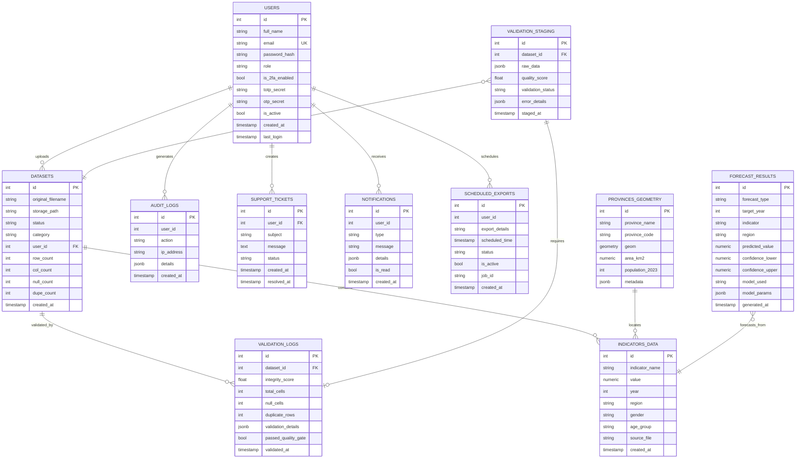
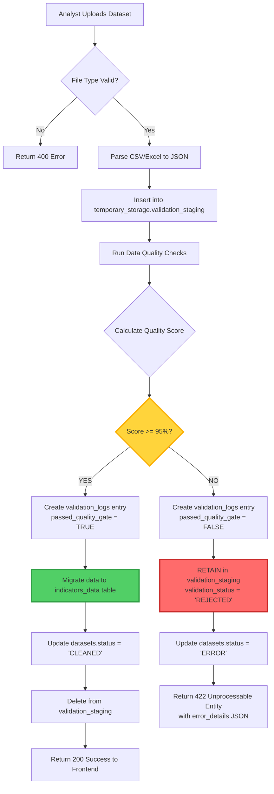

# DataVision Tchad: Database Design & ERD Specification

**Platform**: INSEED Chad Demographic Management System  
**Database Engine**: PostgreSQL 15.3 + PostGIS 3.3  
**Document Version**: 1.0  
**Date**: February 2026  
**Schema Design Philosophy**: Data Sovereignty, Auditability, Spatial Intelligence

---

## Executive Summary

The DataVision Tchad database architecture implements a **multi-schema relational design** with strict data quality enforcement through the **95% Quality Gate** mechanism. All uploaded demographic data must pass validation checks before migrating from the `temporary_storage` schema to the production `public` schema. This ensures that only high-integrity data informs policy decisions for the République du Tchad.

**Key Design Principles**:
- **Blocking Validation**: Data scoring < 95% quality remains quarantined in `validation_staging` table
- **Full Auditability**: Every data modification logged in `audit_logs` with JSONB metadata
- **Spatial Awareness**: PostGIS-enabled geospatial queries for 23 Chadian provinces
- **2FA Security**: TOTP secrets stored with bcrypt-hashed passwords

---

## 1. Entity-Relationship Diagram (ERD)

### 1.1 Core Schema Overview



### 1.2 Schema Organization

The database is organized into **three logical schemas**:

| Schema | Purpose | Tables |
|--------|---------|--------|
| **public** | Core application data | `users`, `datasets`, `audit_logs`, `notifications`, `schedules`, `support_tickets` |
| **temporary_storage** | Pre-validation quarantine | `validation_staging`, `rejected_uploads` |
| **spatial** | GIS reference data | `provinces_geometry`, `departements_boundaries` |

---

## 2. Comprehensive Data Dictionary

### 2.1 Table: `users` (Authentication & Authorization)

| Field Name | Data Type | Constraints | Description | Example Value |
|------------|-----------|-------------|-------------|---------------|
| `id` | SERIAL | PRIMARY KEY | Auto-incrementing unique identifier | 1 |
| `full_name` | VARCHAR(255) | NOT NULL | User's complete name | "Dr. Mahamat Saleh" |
| `email` | VARCHAR(255) | UNIQUE, NOT NULL, INDEX | Institutional email address | "m.saleh@inseed.td" |
| `password_hash` | VARCHAR(255) | NOT NULL | Bcrypt hash (cost factor 12) | "$2b$12$eImiT..." |
| `role` | VARCHAR(50) | NOT NULL, CHECK | User role: 'administrator', 'analyst', 'researcher' | "analyst" |
| `is_2fa_enabled` | BOOLEAN | DEFAULT FALSE | Whether TOTP 2FA is active | TRUE |
| `totp_secret` | VARCHAR(32) | NULLABLE | Base32-encoded TOTP secret | "JBSWY3DPEHPK3PXP" |
| `otp_secret` | VARCHAR(32) | NULLABLE | Legacy OTP secret (deprecated) | NULL |
| `is_active` | BOOLEAN | DEFAULT TRUE | Account status (soft delete flag) | TRUE |
| `created_at` | TIMESTAMP WITH TIME ZONE | DEFAULT NOW() | Account creation timestamp | 2025-01-15 08:30:00+01 |
| `last_login` | TIMESTAMP WITH TIME ZONE | NULLABLE | Last successful authentication | 2026-02-05 09:15:22+01 |

**Indexes**:
- `idx_users_email` on `email` (UNIQUE)
- `idx_users_role` on `role` (for role-based queries)

**Security Notes**:
- Passwords hashed using `bcrypt` with cost factor 12 (via `passlib` in Python)
- TOTP secrets generated using `pyotp.random_base32()` (32-character alphanumeric)
- Email OTP stored in-memory (FastAPI `OTP_STORE` dictionary) with 5-minute TTL

---

### 2.2 Table: `datasets` (Uploaded Data Metadata)

| Field Name | Data Type | Constraints | Description | Example Value |
|------------|-----------|-------------|-------------|---------------|
| `id` | SERIAL | PRIMARY KEY | Unique dataset identifier | 42 |
| `original_filename` | VARCHAR(255) | NOT NULL | Original uploaded file name | "RGPH2024_Mayo-Kebbi.xlsx" |
| `storage_path` | VARCHAR(512) | NOT NULL | Backend file system path | "/app/uploads/2026/42_RGPH2024.xlsx" |
| `status` | VARCHAR(50) | DEFAULT 'PENDING' | Processing status: PENDING, CLEANED, ERROR | "CLEANED" |
| `category` | VARCHAR(100) | NOT NULL | Data category: Demographics, Economic, Health | "Demographics" |
| `user_id` | INTEGER | FOREIGN KEY, INDEX | Uploader's user ID (references `users.id`) | 7 |
| `row_count` | INTEGER | DEFAULT 0 | Total rows in dataset | 15420 |
| `col_count` | INTEGER | DEFAULT 0 | Total columns in dataset | 12 |
| `null_count` | INTEGER | DEFAULT 0 | Total NULL cells detected | 347 |
| `dupe_count` | INTEGER | DEFAULT 0 | Duplicate row count | 23 |
| `created_at` | TIMESTAMP WITH TIME ZONE | DEFAULT NOW() | Upload timestamp | 2026-02-03 14:22:10+01 |

**Quality Metrics Calculation**:
```sql
-- Computed at upload time by FastAPI backend
UPDATE datasets SET
    row_count = (SELECT COUNT(*) FROM validation_staging WHERE dataset_id = datasets.id),
    col_count = (SELECT json_array_length(raw_data::json->0) FROM validation_staging WHERE dataset_id = datasets.id LIMIT 1),
    null_count = (SELECT SUM(jsonb_array_length(null_indices)) FROM validation_staging WHERE dataset_id = datasets.id),
    dupe_count = (SELECT COUNT(*) - COUNT(DISTINCT raw_data) FROM validation_staging WHERE dataset_id = datasets.id);
```

---

### 2.3 Table: `validation_staging` (Temporary Storage Schema)

> [!CAUTION]
> **95% Quality Gate Enforcement Zone**  
> Data in this table CANNOT migrate to production until `quality_score >= 95.0`.

| Field Name | Data Type | Constraints | Description | Example Value |
|------------|-----------|-------------|-------------|---------------|
| `id` | SERIAL | PRIMARY KEY | Staging record ID | 128 |
| `dataset_id` | INTEGER | FOREIGN KEY, INDEX | References `datasets.id` | 42 |
| `raw_data` | JSONB | NOT NULL | Uploaded CSV/Excel data as JSON array | `[{"age": 25, "province": "Mayo-Kebbi"}, ...]` |
| `quality_score` | NUMERIC(5,2) | NOT NULL | Calculated integrity score (0-100) | 87.34 |
| `validation_status` | VARCHAR(50) | DEFAULT 'PENDING' | PENDING, APPROVED, REJECTED | "REJECTED" |
| `error_details` | JSONB | NULLABLE | List of data quality issues | `{"missing_columns": ["birth_date"], "null_rows": [15, 22, 89]}` |
| `staged_at` | TIMESTAMP WITH TIME ZONE | DEFAULT NOW() | When data entered staging | 2026-02-03 14:22:15+01 |

**Schema**: `temporary_storage.validation_staging`

**Quality Score Formula**:
```python
total_cells = row_count * col_count
valid_cells = total_cells - null_count
quality_score = (valid_cells / total_cells) * 100

# Additional penalties:
if dupe_count > 0:
    quality_score -= (dupe_count / row_count) * 10  # Max -10% for duplicates
```

**Migration Logic**:
```sql
-- Executed by FastAPI endpoint POST /api/datasets/{id}/approve
BEGIN;
  -- Only if quality_score >= 95
  INSERT INTO indicators_data (indicator_name, value, year, region, source_file)
  SELECT 
    raw_data->>'indicator',
    (raw_data->>'value')::NUMERIC,
    (raw_data->>'year')::INTEGER,
    raw_data->>'province',
    (SELECT original_filename FROM datasets WHERE id = validation_staging.dataset_id)
  FROM temporary_storage.validation_staging
  WHERE dataset_id = $1 AND quality_score >= 95.0;
  
  -- Update dataset status
  UPDATE datasets SET status = 'CLEANED' WHERE id = $1;
  
  -- Delete from staging (data now in production)
  DELETE FROM temporary_storage.validation_staging WHERE dataset_id = $1;
COMMIT;
```

---

### 2.4 Table: `validation_logs` (Audit Trail for Quality Gate)

| Field Name | Data Type | Constraints | Description | Example Value |
|------------|-----------|-------------|-------------|---------------|
| `id` | SERIAL | PRIMARY KEY | Log entry ID | 203 |
| `dataset_id` | INTEGER | FOREIGN KEY, INDEX | References `datasets.id` | 42 |
| `integrity_score` | NUMERIC(5,2) | NOT NULL | Final calculated quality score | 87.34 |
| `total_cells` | INTEGER | NOT NULL | Total data points analyzed | 185040 |
| `null_cells` | INTEGER | NOT NULL | Count of missing values | 4164 |
| `duplicate_rows` | INTEGER | NOT NULL | Duplicate record count | 23 |
| `validation_details` | JSONB | NULLABLE | Detailed breakdown of errors | `{"outliers": 12, "invalid_dates": 8}` |
| `passed_quality_gate` | BOOLEAN | NOT NULL | TRUE if score >= 95%, FALSE otherwise | FALSE |
| `validated_at` | TIMESTAMP WITH TIME ZONE | DEFAULT NOW() | Validation execution time | 2026-02-03 14:22:18+01 |

**Example JSONB `validation_details`**:
```json
{
  "checks_performed": [
    "null_check",
    "duplicate_check",
    "schema_validation",
    "outlier_detection"
  ],
  "errors": {
    "missing_required_columns": ["date_of_birth"],
    "invalid_province_codes": [15, 89, 142],
    "age_range_violations": [{"row": 230, "age": 150}]
  },
  "warnings": {
    "suspicious_values": [{"row": 45, "field": "income", "value": 0}]
  }
}
```

---

### 2.5 Table: `indicators_data` (Production Demographics Data)

> [!IMPORTANT]
> **Production Schema**  
> Only data that passed the 95% Quality Gate exists in this table.

| Field Name | Data Type | Constraints | Description | Example Value |
|------------|-----------|-------------|-------------|---------------|
| `id` | SERIAL | PRIMARY KEY | Record identifier | 1728493 |
| `indicator_name` | VARCHAR(255) | NOT NULL, INDEX | Demographic indicator type | "Population Totale" |
| `value` | NUMERIC(15,2) | NOT NULL | Indicator measurement | 16244513.00 |
| `year` | INTEGER | NOT NULL, INDEX | Reference year | 2023 |
| `region` | VARCHAR(100) | NULLABLE, INDEX | Province or national level | "Mayo-Kebbi Est" |
| `gender` | VARCHAR(20) | NULLABLE | Gender disaggregation: M, F, NULL | "F" |
| `age_group` | VARCHAR(50) | NULLABLE | Age cohort: 0-4, 5-9, ..., 65+ | "25-29" |
| `source_file` | VARCHAR(255) | NULLABLE | Original dataset filename | "RGPH2024_Mayo-Kebbi.xlsx" |
| `created_at` | TIMESTAMP WITH TIME ZONE | DEFAULT NOW() | Record insertion timestamp | 2026-02-03 14:30:00+01 |

**Composite Index**:
```sql
CREATE INDEX idx_indicators_lookup ON indicators_data(indicator_name, year, region);
```

**Referential Integrity**:
```sql
-- Constraint to ensure region codes match spatial data
ALTER TABLE indicators_data
ADD CONSTRAINT fk_region_geometry
FOREIGN KEY (region) REFERENCES spatial.provinces_geometry(province_name)
ON DELETE RESTRICT;
```

---

### 2.6 Table: `provinces_geometry` (Spatial Schema - PostGIS)

> [!NOTE]
> **Geospatial Reference System**: EPSG:32633 (WGS 84 / UTM zone 33N)  
> Covers all 23 provinces of the République du Tchad.

| Field Name | Data Type | Constraints | Description | Example Value |
|------------|-----------|-------------|-------------|---------------|
| `id` | SERIAL | PRIMARY KEY | Province identifier | 14 |
| `province_name` | VARCHAR(100) | UNIQUE, NOT NULL | Official province name | "Mayo-Kebbi Est" |
| `province_code` | VARCHAR(10) | UNIQUE, NOT NULL | ISO-style province code | "MK-E" |
| `geom` | GEOMETRY(MultiPolygon, 32633) | NOT NULL | PostGIS geometry (administrative boundary) | `MULTIPOLYGON(((15.5 9.2, ...)))` |
| `area_km2` | NUMERIC(10,2) | NOT NULL | Surface area in square kilometers | 14929.45 |
| `population_2023` | INTEGER | NULLABLE | Latest census population estimate | 827463 |
| `metadata` | JSONB | NULLABLE | Additional attributes (capital, departments) | `{"capital": "Bongor", "departments": 5}` |

**Schema**: `spatial.provinces_geometry`

**PostGIS Configuration**:
```sql
-- Enable PostGIS extension
CREATE EXTENSION IF NOT EXISTS postgis;

-- Create spatial index for fast geospatial queries
CREATE INDEX idx_provinces_geom ON spatial.provinces_geometry USING GIST(geom);

-- Set spatial reference system (UTM Zone 33N for Chad)
SELECT UpdateGeometrySRID('spatial', 'provinces_geometry', 'geom', 32633);
```

**Example Spatial Query** (Find all demographic data within a province boundary):
```sql
SELECT 
    i.indicator_name,
    i.value,
    i.year,
    p.province_name,
    ST_Area(p.geom) AS area_m2
FROM indicators_data i
JOIN spatial.provinces_geometry p 
    ON i.region = p.province_name
WHERE ST_Intersects(
    ST_SetSRID(ST_MakePoint(15.4542, 9.0778), 4326),  -- N'Djamena coordinates
    ST_Transform(p.geom, 4326)
);
```

---

### 2.7 Table: `forecast_results` (ML Predictions - Proposed)

> [!WARNING]
> **Status**: PROPOSED - Awaiting XGBoost/Prophet integration  
> Schema defined for Phase 2 implementation (Q2 2026)

| Field Name | Data Type | Constraints | Description | Example Value |
|------------|-----------|-------------|-------------|---------------|
| `id` | SERIAL | PRIMARY KEY | Forecast record ID | 89 |
| `forecast_type` | VARCHAR(50) | NOT NULL | Model type: POPULATION, GDP, FERTILITY | "POPULATION" |
| `target_year` | INTEGER | NOT NULL | Prediction year (12-36 months ahead) | 2028 |
| `indicator` | VARCHAR(255) | NOT NULL | Specific indicator being forecasted | "Population Totale" |
| `region` | VARCHAR(100) | NULLABLE | Province-level or national | "Mayo-Kebbi Est" |
| `predicted_value` | NUMERIC(15,2) | NOT NULL | Point estimate | 18500000.00 |
| `confidence_lower` | NUMERIC(15,2) | NOT NULL | 95% confidence interval lower bound | 17200000.00 |
| `confidence_upper` | NUMERIC(15,2) | NOT NULL | 95% confidence interval upper bound | 19800000.00 |
| `model_used` | VARCHAR(100) | NOT NULL | Algorithm: PROPHET, XGBOOST, ARIMA | "PROPHET" |
| `model_params` | JSONB | NULLABLE | Hyperparameters used | `{"seasonality_mode": "multiplicative", "growth": "logistic"}` |
| `generated_at` | TIMESTAMP WITH TIME ZONE | DEFAULT NOW() | Forecast creation timestamp | 2026-02-05 11:00:00+01 |

**Foreign Key** (once implemented):
```sql
ALTER TABLE forecast_results
ADD CONSTRAINT fk_forecast_region
FOREIGN KEY (region) REFERENCES spatial.provinces_geometry(province_name);
```

---

### 2.8 Table: `audit_logs` (System Activity Tracking)

| Field Name | Data Type | Constraints | Description | Example Value |
|------------|-----------|-------------|-------------|---------------|
| `id` | SERIAL | PRIMARY KEY | Log entry ID | 45231 |
| `user_id` | INTEGER | INDEX, NULLABLE | Actor (NULL for system actions) | 7 |
| `action` | VARCHAR(255) | NOT NULL, INDEX | Action type | "DATASET_UPLOAD" |
| `ip_address` | VARCHAR(45) | NULLABLE | IPv4/IPv6 address | "196.168.1.45" |
| `details` | JSONB | NULLABLE | Contextual metadata | `{"dataset_id": 42, "filename": "RGPH2024.xlsx"}` |
| `created_at` | TIMESTAMP WITH TIME ZONE | DEFAULT NOW(), INDEX | Event timestamp | 2026-02-03 14:22:10+01 |

**Common Action Types**:
- `LOGIN_SUCCESS`, `LOGIN_FAILED`
- `DATASET_UPLOAD`, `DATASET_APPROVED`, `DATASET_REJECTED`
- `REPORT_GENERATION`, `EXPORT_CSV`, `EXPORT_PDF`
- `USER_CREATED`, `USER_DEACTIVATED`
- `2FA_ENABLED`, `2FA_DISABLED`

**Example JSONB `details` for Dataset Upload**:
```json
{
  "dataset_id": 42,
  "filename": "RGPH2024_Mayo-Kebbi.xlsx",
  "file_size_mb": 3.7,
  "row_count": 15420,
  "quality_score": 87.34,
  "validation_status": "REJECTED"
}
```

---

### 2.9 Supporting Tables (Notifications, Schedules, Support)

#### Table: `notifications`

| Field | Type | Constraints | Description |
|-------|------|-------------|-------------|
| `id` | SERIAL | PRIMARY KEY | Notification ID |
| `user_id` | INTEGER | FK `users.id`, INDEX | Recipient |
| `type` | VARCHAR(50) | NOT NULL | EXPORT_READY, DATASET_APPROVED, SYSTEM_ALERT |
| `message` | VARCHAR(500) | NOT NULL | User-facing message |
| `details` | JSONB | NULLABLE | Additional data (download link, etc.) |
| `is_read` | BOOLEAN | DEFAULT FALSE | Read status |
| `created_at` | TIMESTAMP WITH TIME ZONE | DEFAULT NOW() | Notification time |

#### Table: `schedules` (Scheduled Exports)

| Field | Type | Constraints | Description |
|-------|------|-------------|-------------|
| `id` | SERIAL | PRIMARY KEY | Schedule ID |
| `user_id` | INTEGER | FK `users.id`, INDEX | Requester |
| `export_details` | VARCHAR(500) | NULLABLE | Description (e.g., "GDP 2025-2029") |
| `scheduled_time` | TIMESTAMP WITH TIME ZONE | NOT NULL | Execution time |
| `status` | VARCHAR(50) | DEFAULT 'PENDING' | PENDING, TRIGGERED, COMPLETED |
| `is_active` | BOOLEAN | DEFAULT TRUE | Cancellation flag |
| `job_id` | VARCHAR(100) | NULLABLE | APScheduler job ID |
| `created_at` | TIMESTAMP WITH TIME ZONE | DEFAULT NOW() | Request time |

#### Table: `support_tickets`

| Field | Type | Constraints | Description |
|-------|------|-------------|-------------|
| `id` | SERIAL | PRIMARY KEY | Ticket ID |
| `user_id` | INTEGER | FK `users.id`, INDEX | Reporter |
| `subject` | VARCHAR(255) | NOT NULL | Issue title |
| `message` | TEXT | NOT NULL | Detailed description |
| `status` | VARCHAR(50) | DEFAULT 'OPEN' | OPEN, IN_PROGRESS, RESOLVED |
| `created_at` | TIMESTAMP WITH TIME ZONE | DEFAULT NOW() | Submission time |
| `resolved_at` | TIMESTAMP WITH TIME ZONE | NULLABLE | Resolution timestamp |

---

## 3. The 95% Quality Gate: Blocking Mechanism

### 3.1 Enforcement Workflow



### 3.2 Backend Implementation (FastAPI)

**File**: `Backend/app/api/v1/datasets.py`

```python
from fastapi import APIRouter, UploadFile, HTTPException
from app.db.session import get_db
from app.models import Dataset, ValidationLog
from sqlalchemy.orm import Session

@router.post("/upload")
async def upload_dataset(file: UploadFile, db: Session = Depends(get_db)):
    # 1. Parse file to DataFrame
    df = pd.read_excel(file.file) if file.filename.endswith('.xlsx') else pd.read_csv(file.file)
    
    # 2. Calculate quality metrics
    total_cells = df.shape[0] * df.shape[1]
    null_count = df.isnull().sum().sum()
    dupe_count = df.duplicated().sum()
    
    quality_score = ((total_cells - null_count) / total_cells) * 100
    if dupe_count > 0:
        quality_score -= (dupe_count / df.shape[0]) * 10
    
    # 3. Store in validation_staging
    staging_record = {
        "dataset_id": dataset.id,
        "raw_data": df.to_json(orient='records'),
        "quality_score": quality_score,
        "validation_status": "PENDING"
    }
    db.execute("INSERT INTO temporary_storage.validation_staging (...) VALUES (...)")
    
    # 4. QUALITY GATE ENFORCEMENT
    if quality_score >= 95.0:
        # PASS: Migrate to production
        for _, row in df.iterrows():
            indicators_record = IndicatorData(
                indicator_name=row['indicator'],
                value=row['value'],
                year=row['year'],
                region=row['province'],
                source_file=file.filename
            )
            db.add(indicators_record)
        
        dataset.status = "CLEANED"
        log = ValidationLog(
            dataset_id=dataset.id,
            integrity_score=quality_score,
            passed_quality_gate=True
        )
        db.add(log)
        db.execute("DELETE FROM temporary_storage.validation_staging WHERE dataset_id = %s", dataset.id)
        db.commit()
        return {"status": "success", "quality_score": quality_score}
    
    else:
        # FAIL: Block migration, retain in staging
        dataset.status = "ERROR"
        log = ValidationLog(
            dataset_id=dataset.id,
            integrity_score=quality_score,
            passed_quality_gate=False,
            validation_details={
                "null_count": int(null_count),
                "duplicate_rows": int(dupe_count),
                "required_score": 95.0
            }
        )
        db.add(log)
        db.commit()
        raise HTTPException(
            status_code=422,
            detail={
                "error": "Quality Gate Failed",
                "quality_score": quality_score,
                "required_score": 95.0,
                "null_cells": int(null_count),
                "duplicate_rows": int(dupe_count),
                "message": "Data retained in temporary storage. Please clean and re-upload."
            }
        )
```

---

## 4. Database Creation Scripts

### 4.1 Schema Initialization

```sql
-- Create schemas
CREATE SCHEMA IF NOT EXISTS temporary_storage;
CREATE SCHEMA IF NOT EXISTS spatial;

-- Enable PostGIS
CREATE EXTENSION IF NOT EXISTS postgis;

-- Core tables (public schema)
CREATE TABLE users (
    id SERIAL PRIMARY KEY,
    full_name VARCHAR(255) NOT NULL,
    email VARCHAR(255) UNIQUE NOT NULL,
    password_hash VARCHAR(255) NOT NULL,
    role VARCHAR(50) NOT NULL CHECK (role IN ('administrator', 'analyst', 'researcher')),
    is_2fa_enabled BOOLEAN DEFAULT FALSE,
    totp_secret VARCHAR(32),
    otp_secret VARCHAR(32),
    is_active BOOLEAN DEFAULT TRUE,
    created_at TIMESTAMP WITH TIME ZONE DEFAULT NOW(),
    last_login TIMESTAMP WITH TIME ZONE
);

CREATE TABLE datasets (
    id SERIAL PRIMARY KEY,
    original_filename VARCHAR(255) NOT NULL,
    storage_path VARCHAR(512) NOT NULL,
    status VARCHAR(50) DEFAULT 'PENDING',
    category VARCHAR(100) NOT NULL,
    user_id INTEGER REFERENCES users(id) ON DELETE SET NULL,
    row_count INTEGER DEFAULT 0,
    col_count INTEGER DEFAULT 0,
    null_count INTEGER DEFAULT 0,
    dupe_count INTEGER DEFAULT 0,
    created_at TIMESTAMP WITH TIME ZONE DEFAULT NOW()
);

-- Temporary storage schema
CREATE TABLE temporary_storage.validation_staging (
    id SERIAL PRIMARY KEY,
    dataset_id INTEGER REFERENCES datasets(id) ON DELETE CASCADE,
    raw_data JSONB NOT NULL,
    quality_score NUMERIC(5,2) NOT NULL,
    validation_status VARCHAR(50) DEFAULT 'PENDING',
    error_details JSONB,
    staged_at TIMESTAMP WITH TIME ZONE DEFAULT NOW()
);

CREATE TABLE validation_logs (
    id SERIAL PRIMARY KEY,
    dataset_id INTEGER REFERENCES datasets(id),
    integrity_score NUMERIC(5,2) NOT NULL,
    total_cells INTEGER NOT NULL,
    null_cells INTEGER NOT NULL,
    duplicate_rows INTEGER NOT NULL,
    validation_details JSONB,
    passed_quality_gate BOOLEAN NOT NULL,
    validated_at TIMESTAMP WITH TIME ZONE DEFAULT NOW()
);

-- Production data
CREATE TABLE indicators_data (
    id SERIAL PRIMARY KEY,
    indicator_name VARCHAR(255) NOT NULL,
    value NUMERIC(15,2) NOT NULL,
    year INTEGER NOT NULL,
    region VARCHAR(100),
    gender VARCHAR(20),
    age_group VARCHAR(50),
    source_file VARCHAR(255),
    created_at TIMESTAMP WITH TIME ZONE DEFAULT NOW()
);

-- Spatial data
CREATE TABLE spatial.provinces_geometry (
    id SERIAL PRIMARY KEY,
    province_name VARCHAR(100) UNIQUE NOT NULL,
    province_code VARCHAR(10) UNIQUE NOT NULL,
    geom GEOMETRY(MultiPolygon, 32633) NOT NULL,
    area_km2 NUMERIC(10,2) NOT NULL,
    population_2023 INTEGER,
    metadata JSONB
);

-- Forecast results (proposed)
CREATE TABLE forecast_results (
    id SERIAL PRIMARY KEY,
    forecast_type VARCHAR(50) NOT NULL,
    target_year INTEGER NOT NULL,
    indicator VARCHAR(255) NOT NULL,
    region VARCHAR(100),
    predicted_value NUMERIC(15,2) NOT NULL,
    confidence_lower NUMERIC(15,2) NOT NULL,
    confidence_upper NUMERIC(15,2) NOT NULL,
    model_used VARCHAR(100) NOT NULL,
    model_params JSONB,
    generated_at TIMESTAMP WITH TIME ZONE DEFAULT NOW()
);

-- Audit and support
CREATE TABLE audit_logs (
    id SERIAL PRIMARY KEY,
    user_id INTEGER,
    action VARCHAR(255) NOT NULL,
    ip_address VARCHAR(45),
    details JSONB,
    created_at TIMESTAMP WITH TIME ZONE DEFAULT NOW()
);

CREATE TABLE notifications (
    id SERIAL PRIMARY KEY,
    user_id INTEGER REFERENCES users(id),
    type VARCHAR(50) NOT NULL,
    message VARCHAR(500) NOT NULL,
    details JSONB,
    is_read BOOLEAN DEFAULT FALSE,
    created_at TIMESTAMP WITH TIME ZONE DEFAULT NOW()
);

CREATE TABLE schedules (
    id SERIAL PRIMARY KEY,
    user_id INTEGER REFERENCES users(id),
    export_details VARCHAR(500),
    scheduled_time TIMESTAMP WITH TIME ZONE NOT NULL,
    status VARCHAR(50) DEFAULT 'PENDING',
    is_active BOOLEAN DEFAULT TRUE,
    job_id VARCHAR(100),
    created_at TIMESTAMP WITH TIME ZONE DEFAULT NOW()
);

CREATE TABLE support_tickets (
    id SERIAL PRIMARY KEY,
    user_id INTEGER REFERENCES users(id),
    subject VARCHAR(255) NOT NULL,
    message TEXT NOT NULL,
    status VARCHAR(50) DEFAULT 'OPEN',
    created_at TIMESTAMP WITH TIME ZONE DEFAULT NOW(),
    resolved_at TIMESTAMP WITH TIME ZONE
);

-- Indexes
CREATE INDEX idx_users_email ON users(email);
CREATE INDEX idx_users_role ON users(role);
CREATE INDEX idx_datasets_user_id ON datasets(user_id);
CREATE INDEX idx_datasets_status ON datasets(status);
CREATE INDEX idx_indicators_lookup ON indicators_data(indicator_name, year, region);
CREATE INDEX idx_audit_logs_user_id ON audit_logs(user_id);
CREATE INDEX idx_audit_logs_action ON audit_logs(action);
CREATE INDEX idx_audit_logs_created_at ON audit_logs(created_at);
CREATE INDEX idx_provinces_geom ON spatial.provinces_geometry USING GIST(geom);
```

---

## 5. Data Integrity Constraints

### 5.1 Foreign Key Relationships

```sql
-- Enforce referential integrity
ALTER TABLE datasets ADD CONSTRAINT fk_datasets_user FOREIGN KEY (user_id) REFERENCES users(id) ON DELETE SET NULL;
ALTER TABLE validation_logs ADD CONSTRAINT fk_validation_dataset FOREIGN KEY (dataset_id) REFERENCES datasets(id) ON DELETE CASCADE;
ALTER TABLE temporary_storage.validation_staging ADD CONSTRAINT fk_staging_dataset FOREIGN KEY (dataset_id) REFERENCES datasets(id) ON DELETE CASCADE;
ALTER TABLE audit_logs ADD CONSTRAINT fk_audit_user FOREIGN KEY (user_id) REFERENCES users(id) ON DELETE SET NULL;
```

### 5.2 Check Constraints

```sql
-- Ensure quality score is within valid range
ALTER TABLE temporary_storage.validation_staging ADD CONSTRAINT chk_quality_score CHECK (quality_score >= 0 AND quality_score <= 100);

-- Ensure forecast confidence intervals are logical
ALTER TABLE forecast_results ADD CONSTRAINT chk_confidence_bounds CHECK (confidence_lower <= predicted_value AND predicted_value <= confidence_upper);

-- Ensure year values are reasonable
ALTER TABLE indicators_data ADD CONSTRAINT chk_year_range CHECK (year >= 1960 AND year <= 2100);
```

---

## 6. Sample Data for Testing

### 6.1 Seed Users (Development)

```sql
INSERT INTO users (full_name, email, password_hash, role, is_2fa_enabled) VALUES
('Dr. Mahamat Saleh', 'basharbidjere@gmail.com', '$2b$12$eImiT...', 'administrator', TRUE),
('Amina Ahmat', 'scoopsofficial01@gmail.com', '$2b$12$fPqrT...', 'analyst', FALSE),
('Dr. Ibrahim Youssouf', 'bbidjere@gmail.com', '$2b$12$gQstU...', 'researcher', FALSE);
```

### 6.2 Seed Geospatial Data (23 Provinces)

```sql
INSERT INTO spatial.provinces_geometry (province_name, province_code, geom, area_km2, population_2023, metadata) VALUES
('N''Djamena', 'ND', ST_GeomFromText('MULTIPOLYGON(((15.0 12.1, 15.2 12.1, 15.2 11.9, 15.0 11.9, 15.0 12.1)))', 32633), 1978.5, 1605696, '{"capital": "N''Djamena", "departments": 10}'),
('Mayo-Kebbi Est', 'MK-E', ST_GeomFromText('MULTIPOLYGON(((14.5 9.5, 15.5 9.5, 15.5 8.5, 14.5 8.5, 14.5 9.5)))', 32633), 14929.45, 827463, '{"capital": "Bongor", "departments": 5}');
-- ... (21 more provinces)
```

---

**Document Prepared By**: Antigravity AI for INSEED Chad  
**Review Status**: Pending Database Administrator Review  
**Next Update**: Upon XGBoost/Prophet ML integration
